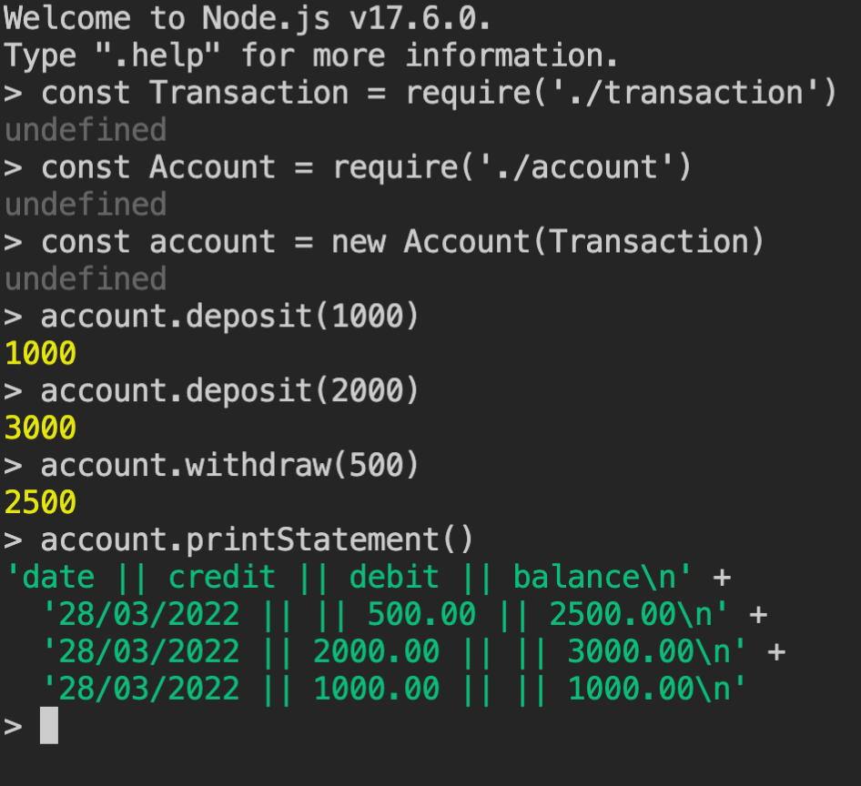

# Bank Tech Test

A simple banking application to run in Node.js written as a practice technical test at Makers.

### Setup

To install the program make sure you have:

[Node.js](https://nodejs.org/en/) - written in version 17.6

Run ```npm install```

#### Includes

[Jest](https://jestjs.io)  
[ESLint](https://eslint.org)

## Starting the application

Run the application in REPL



Run tests ```jest``` or ```npm test```.

### Approach and Structure

- In a bank you have many accounts. Determining the first class to be account. This will hold the details of an individuals actions.

- Each account will have a balance value that can be manipulated depending on what the user wants to do.

- Each time a user interacts a new Transaction/record should be saved of this event. Transaction class holds the details of an individual record.

- When a user wants to print their statement they can retrieve all the Transactions stored and individually format them.

### Acceptance Criteria

**Given** a client makes a deposit of 1000 on 10-01-2023  
**And** a deposit of 2000 on 13-01-2023  
**And** a withdrawal of 500 on 14-01-2023  
**When** she prints her bank statement  
**Then** she would see

```
date || credit || debit || balance
14/01/2023 || || 500.00 || 2500.00
13/01/2023 || 2000.00 || || 3000.00
10/01/2023 || 1000.00 || || 1000.00
```
